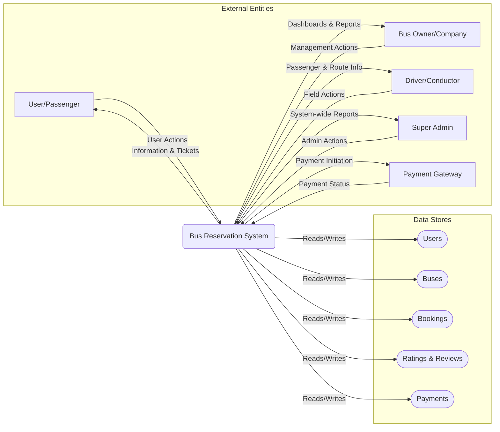

```mermaid
graph LR
    %% External Entities
    subgraph External Entities
        User[User/Passenger]
        Owner[Bus Owner/Company]
        Driver[Driver/Conductor]
        Admin[Super Admin]
        PaymentGateway[Payment Gateway]
    end

    %% Main Process
    System(Bus Reservation System)

    %% Data Stores
    subgraph Data Stores
        UsersDS([Users])
        BusesDS([Buses])
        BookingsDS([Bookings])
        RatingsDS([Ratings & Reviews])
        PaymentsDS([Payments])
    end

    %% Data Flows from Entities to System
    User -- "User Actions" --> System
    Owner -- "Management Actions" --> System
    Driver -- "Field Actions" --> System
    Admin -- "Admin Actions" --> System
    PaymentGateway -- "Payment Status" --> System

    %% Data Flows from System to Entities
    System -- "Information & Tickets" --> User
    System -- "Dashboards & Reports" --> Owner
    System -- "Passenger & Route Info" --> Driver
    System -- "System-wide Reports" --> Admin
    System -- "Payment Initiation" --> PaymentGateway

    %% System to Data Stores
    System -- "Reads/Writes" --> UsersDS
    System -- "Reads/Writes" --> BusesDS
    System -- "Reads/Writes" --> BookingsDS
    System -- "Reads/Writes" --> RatingsDS
    System -- "Reads/Writes" --> PaymentsDS
```